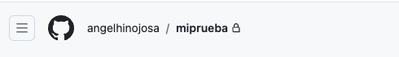
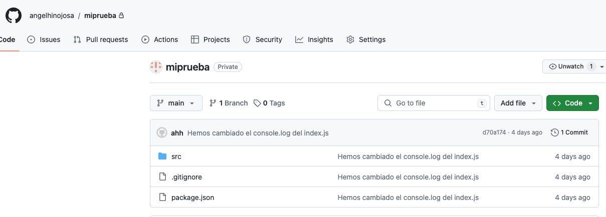

# Entrega Git

## 1. Crear un repositorio en local
### ruta -> /Users/ahh/Desktop/Cursos/LemonCode/
### mkdir miprueba
### ruta -> /Users/ahh/Desktop/Cursos/LemonCode/miprueba
### git init
### git add .
### git commit -m "hola git"

## 2. Subir el repositorio a GitHub

###  git@github.com:angelhinojosa/miprueba.git

He configurado la conexión ssh

### git clone git@github.com:angelhinojosa/miprueba.git

## 3. Hacer un commit y un push

Creo la carpeta images para guardar las capturas.

### git init
### git add .
### git commit -m "Añado carpeta images"
### git push

 

## 4. Crear una rama

### git brach development

### git checkout development

### git add .

### git commit -a -m "Añado captura rama Development"

### git push

## 5. Hacer un merge

### git checkout main

### git merge development -m "mezclado development businees.js"

### git push

 Vuelvo a repetir creando una nueva rama para ver si consigo ver porque
no me muestra el dibujo de las ramas con el git log..... Rama Prueba 1

